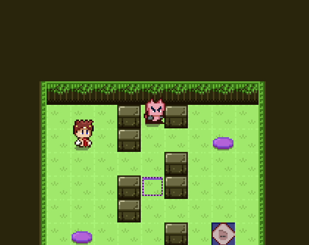

# Excalibatta



A small puzzle game built in Excalibur and React.  
This game is a Excalibur port of a React game called [Ciabattas Revenge](https://drewconley.itch.io/ciabattas-revenge)

The core game mechanic, concepts and assets are all based on the excellent tutorial series by Drew Conley.  
The tutorial series can be found here: https://courses.drewconley.dev/

## Play game

🕹️ [Play game](https://excalibatta.netlify.app/) 🕹️

Stack:

- [Excalibur](https://excaliburjs.com/)
- [TypeScript](https://www.typescriptlang.org/)
- [Vite](https://vitejs.dev/)
- [React](https://react.dev/)

**Note:** This version still uses React, but only for the UI

## Usage

To run the game locally, follow these steps:

1. **Clone the repository:**

   ```bash
   git clone https://github.com/yourusername/excalibatta.git
   cd excalibatta
   ```

2. **Install dependencies:**

   Make sure you have [Node.js](https://nodejs.org/) installed, then run:

   ```bash
   npm install
   ```

3. **Run the development server:**

   Start the development server with:

   ```bash
   npm run dev
   ```

   This will start the server and you can view the game in your browser at `http://localhost:3000`.

4. **Build for production:**

   To create a production build, run:

   ```bash
   npm run build
   ```

   The build will be output to the `dist` directory.
